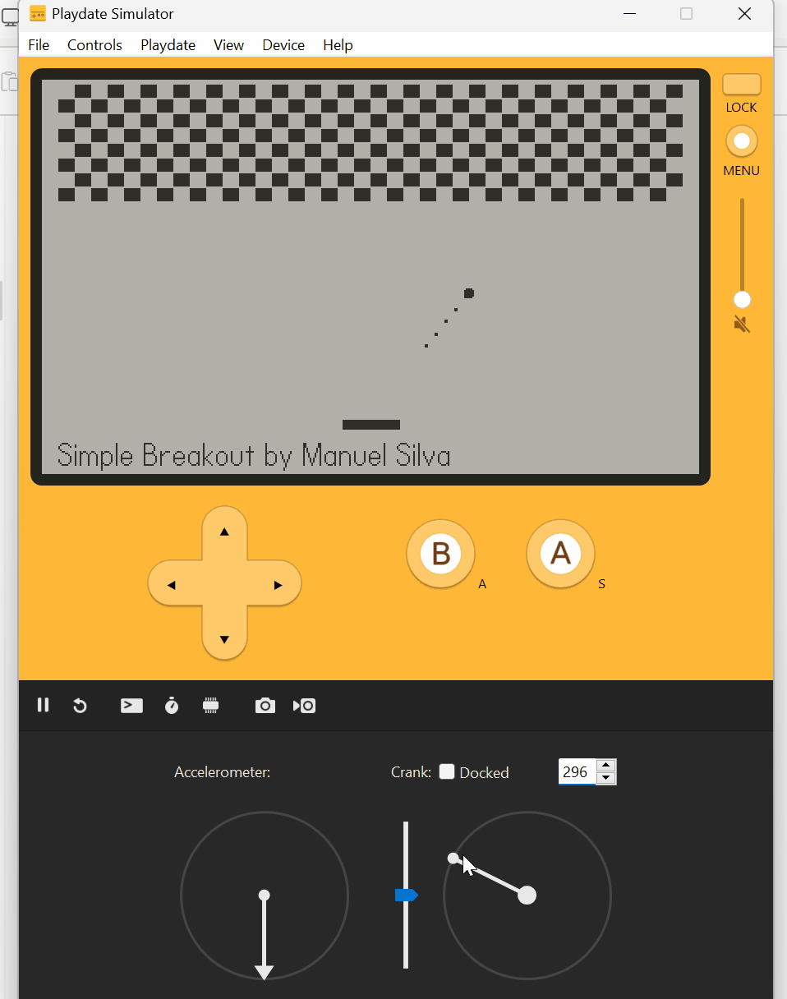

# Playdate Breakout by Manuel Silva

Ive been playing around with making game on the Playdate with C.
Sharing this since I'm noticing there are not many resources out there for people programming in C for the playdate.

This project can serve as an easy Hello World like template for creating other games.

## Controls

- **Paddle Movement**: Use the crank to move the paddle left and right.

\*There is no ending in the game, game just restarts on loss for now.

## Installation

To install the game on your Playdate console, follow these steps:

1. Download the latest release of the game from the [Releases](https://github.com/ManuelSilva/PlayDateBreakout/releases/tag/pdx_release) section.
2. Connect your Playdate console to your computer via USB.
3. Use the Playdate software to sideload the game onto your console.
4. Disconnect the USB and launch the game from the Playdate menu.

## Resources

If you re interested in making games for the Playdate in C.
Check this links out.

 - https://play.date/
 - https://sdk.play.date/2.4.2/Inside%20Playdate%20with%20C.html
 - https://devforum.play.date/t/c-template-setup-on-windows-2023/12819/5
 - https://github.com/srburk/Playdate-C-Template

also if you're stuck I added a couple of tricky set up steps explained step by step here [Link](https://github.com/ManuelSilva/PlayDateBreakout/blob/main/Breakout/SetUpGuide.txt)

## License

This project is licensed under the MIT License. See the [LICENSE](https://github.com/ManuelSilva/PlayDateBreakout/blob/main/LICENSE) file for more details.
